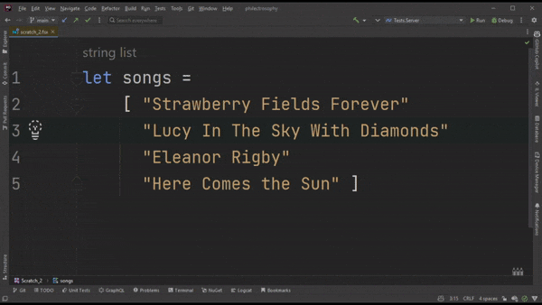

## Introduction

Hello, fellow F# nerds! In this post, I'll be diving into the world of multiline bracket formatting styles (✨ so exhilarating ✨). Specifically, I'll be exploring the differences between [_cramped_](https://learn.microsoft.com/en-us/dotnet/fsharp/style-guide/formatting#multiline-bracket-formatting-styles) and [_aligned_](https://learn.microsoft.com/en-us/dotnet/fsharp/style-guide/formatting#multiline-bracket-formatting-styles) bracket styles.[POP]Note: [_Stroustrup_](https://en.wikipedia.org/wiki/Indentation_style#Variant:_Stroustrup) is another option, but we won't be discussing it here. Luckily, it's close enough to _aligned_ that the subsequent discussion will apply to _Stroustrup_.[/POP] Let's kick things off with a brief rundown of these formatting styles using a simple example:

#### Aligned:
```fsharp
let band =
    {
        Vocals = "John"
        Bass = "Paul"
        Guitar = "George"
        Drums = "Ringo"
    }

let songs =
    [
        "Strawberry Fields Forever"
        "Lucy In The Sky With Diamonds"
        "Eleanor Rigby"
        "Here Comes the Sun"
    ]
```

<br/>

#### Cramped:
```fsharp
let band =
    { Vocals = "John"
      Bass = "Paul"
      Guitar = "George"
      Drums = "Ringo" }
      
let songs =
    [ "Strawberry Fields Forever"
      "Lucy In The Sky With Diamonds"
      "Eleanor Rigby"
      "Here Comes the Sun" ]
```

As you can see, the _cramped_ style shoves the beginning and end members onto the same line as the beginning and end brackets, while _aligned_ offers us a bit more breathing room. 

In F#, _cramped_ is the standard bracket format style, and the default option of the most popular code formatter, [Fantomas](https://fsprojects.github.io/fantomas/). However, it's my view that cramped causes far more headaches than it provides benefits (the use of the word "cramped" suggests the F# community may feel the same way). So, in this post I'll argue that it's time to stretch out our code and bid farewell to those cramps! Let's jump in and take a closer look at how multiline bracket formatting styles can impact our F# code readability and maintainability.

## Edit-ability

> There are a finite number of keystrokes left in your hands before you die.
> 
> _-- Scott Hanselman_

When using cramped brackets many of the most common editor actions go from being trivial to a nuisance. Let's run through a few.

### Reordering
Most IDEs let you reorder lines of code with a simple key-bind (e.g., <kbd>Alt + &uarr;/&darr;</kbd> in VS Code). Let's take a stab at this with aligned brackets:


Dead simple!

Now how about with cramped brackets?



This was my best attempt after several tries. While I'm sure I could get more efficient with some practice, there's no getting around the additional steps for those pesky top and bottom brackets.

### Line Deletions

> "The best code is no code at all."
>
> _-- Jeff Atwood_

IDEs also make it easy to remove lines of code (who doesn't love deleting code) with a quick key-bind (<kbd>Ctrl + Shift + K</kbd> in VS Code). Let's delete the first and last item from our list of `songs`, first with aligned brackets:


Easy.

Now with cramped brackets:


 Less easy. 

### Commenting Out Lines

Similar to deleting code, but for circumstances in which you only want to remove members temporary while you test something out. Again, let's comment out the first and last items of our list of `songs`, starting with aligned brackets: 


Wonderful.

Now with cramped brackets:


Oof...

### Additions

Of course, we need to write new code, too! So how hard is it to add new songs to our list? Here's some additions with aligned brackets:


Marvelous👌

And cramped?


Honestly, better than I expected. But still not great.

## Readability

As developers, we do far more than write code. We also need to read (and _understand_) code!

> Indeed, the ratio of time spent reading versus writing is well over 10 to 1. We are constantly reading old code as part of the effort to write new code. ...[Therefore,] making it easy to read makes it easier to write.
> 
> _-- Robert C. Martin_

The less brain power we need to use to visually process information, the more we have available for reasoning about the problem at hand!

### Visualizing Scope
Quickly discerning the scope of an expression is essential to understanding the code you're scrutinizing. Let's compared how easily we can discern scope with our two bracket styles.

Using aligned brackets, we see that the beginning and end brackets line up, creating a quick visual guide. And in many IDEs a line is even drawn between these aligned brackets, making it even easier! To really highlight this, I've installed the [Indent Rainbow plugin](https://plugins.jetbrains.com/plugin/13308-indent-rainbow). Take a look:


You can almost taste that rainbow!

Now let's see how it looks with cramped brackets:


That's a lot of visual noise! The final line is particularly egregious, 😵‍💫 `} } ] }`.


### Inconsistent Spacing
By default, indentations in F# are 4 spaces. With aligned brackets you get exactly what you'd expect. Note the gray vertical lines in the snippet below. There are four spaces between each:


Now with cramped brackets:


You'll note that the gray vertical lines are inconsistently spaced. Sometimes we get four spaces, as we'd expect, and other times we get two! 

This isn't problematic simply for aesthetic reasons, _though there is certainly something to be said about how visual noise impacts our ability to process information_.  It's problematic because it can be challenging to determine the appropriate number of spaces to use as you write your code. For instance, the `Toppings` list begins on the 5th line with a four-space indent from the previous line, even though the prior two lines have only a two-space indent. It would be understandable if someone tried to use two spaces to be consistent with the previous lines, or even six in order to maintain a four-space indent from the start of `Toppings`.


## A Point in Cramped's Favor

There is one benefit to cramped, which is that it takes up far less vertical space:

```fsharp
let cramped =
    { Location = "Sunnyville"
      Sundaes =
        [ "Savoy Truffle",
          { Toppings =
              [ { Name = "Chocolate chips"
                  Calories = 50 }
                { Name = "Truffle cream"
                  Calories = 30 } ]
            IceCream = { Flavor = "Vanilla"; Scoops = 2 } }
          "Strawberry Fields",
          { Toppings =
              [ { Name = "Strawberry sauce"
                  Calories = 60 }
                { Name = "Rainbow sprinkles"
                  Calories = 40 } ]
            IceCream = { Flavor = "Strawberry"; Scoops = 2 } } ] }

let aligned =
    {
        Location = "Sunnyville"
        Sundaes =
            [
                "Savoy Truffle",
                {
                    Toppings =
                        [
                            {
                                Name = "Chocolate chips"
                                Calories = 50
                            }
                            {
                                Name = "Truffle cream"
                                Calories = 30
                            }
                        ]
                    IceCream = { Flavor = "Vanilla"; Scoops = 2 }
                }
                "Strawberry Fields",
                {
                    Toppings =
                        [
                            {
                                Name = "Strawberry sauce"
                                Calories = 60
                            }
                            {
                                Name = "Rainbow sprinkles"
                                Calories = 40
                            }
                        ]
                    IceCream = { Flavor = "Strawberry"; Scoops = 2 }
                }
            ]
    }
```

That said, it takes up the same amount of horizontal space. Given the use and split editors and multiple reference windows, I find horizontal space to be more useful. So, for me this isn't a deal-breaker. Nevertheless, there's no denying that cramped is more, well, cramped!

Speaking of horizontal space, what if we decided to use two-space indentations instead of four? According to the official [F# Style Guide](https://learn.microsoft.com/en-us/dotnet/fsharp/style-guide/formatting#use-consistent-indentation) this is a legitimate option. It would certainly provide us more horizontal space! 

We can use the [online Fantomas tool](https://fsprojects.github.io/fantomas-tools/#/fantomas/preview) and set `IndentSize` to two. Now scroll down and set `MultilineBracketStyle` to `Aligned`. Things look as you would expect:


Now change the `MultilineBracketStyle` to `Cramped` instead. Copying that code into an IDE we get this:


The code doesn't even compile...


## How to Make the Change
Ready to rid yourself of cramps?

 If you're using Fantomas, you can modify the `.editorconifg` file ([see documentation](https://fsprojects.github.io/fantomas/docs/end-users/Configuration.html)) by adding the `fsharp_multiline_bracket_style = aligned` setting ([see documentation](https://fsprojects.github.io/fantomas/docs/end-users/Configuration.html#fsharp_multiline_bracket_style)).

If you're using your editor's built in formatter, take a look through its settings. In Jetbrains Rider, for example, it's under `Settings > Editor > Code Style > F#` and the setting is a checkbox labeled _"Align opening and closing braces of record, array and list expressions"_.  

Now let your code can take a big stretch and get some fresh air!