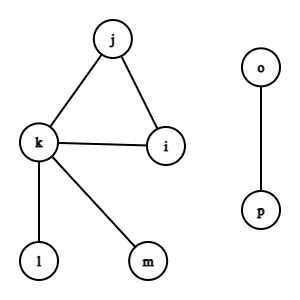

## Introduction

Welcome to the 6th post on FP solutions to interview problems, and the second post on graphs. In this post, we'll use the `traverse` function we built in [the previous post](http://philectrosophy.com/) to determine whether a path exists between two nodes in a graph. 

## Problem Statement

Here's the problem as stated [on LeetCode](https://leetcode.com/problems/find-if-path-exists-in-graph/):

> Given an undirected, cyclic graph represented by an edge list, write a function that determines whether a path exists between two nodes...
> 
> ```fsharp
>  let hasPath src dst edgeList =   // 'a -> 'a -> 'a list -> bool
>       ...
>  ```
> 
> ### Example
> Given the following graph: 
> <br/>
> 
> <br/>
> Represented by this edge list:
> 
>  ```fsharp
> let edgeList =
>       [
>           "i", "j"
>           "i", "k"
>           "j", "k"
>           "k", "l"
>           "k", "m"
>           "o", "p"
>       ]
>  ```
>
> The function should have the following outputs:
> 
> ```fsharp
> edgeList |> hasPath "i" "m"   // returns true
> ```
> **Output:** true
>
> ```fsharp
> edgeList |> hasPath "i" "p"   // returns false
> ```
> **Output:** false

Let's have a look, shall we?

## Solution
### Preliminary Discussion

The first thing to note is that the problem statement provides us with an _edge list_, but our `traverse` function from [the previous post](http://philectrosophy.com/) takes an adjacency list. To handle this, we can use the `EdgeList` module we wrote to make the conversion:

```fsharp
let private hasPathTraverse src dst adjList =
    ...
    
let hasPath src dst edgeList =
    edgeList
    |> EdgeList.Undirected.toAdjacencyList
    |> hasPathTraverse src dst
```

The second thing to note is that the graph is cyclic. we need to make sure we don't get stuck in an infinite loop. To do this, we can use a set to keep track of the nodes we've already visited, like we did in [the previous post](http://philectrosophy.com/). Here's the code that does this:

```fsharp
...
if visited |> Set.contains head
then traverse tail visited
else
    let newStack = tail @ (graph |> Map.find head)
    let newVisited = visited |> Set.add head

    traverse newStack newVisited
...
```

The last thing we need to decide upon is whether to use depth-first or breadth-first traversal. This is a case where (to the best of my knowledge) it doesn't matter which one we use. So, arbitrarily, we'll go with breadth-first search.

### Implementation

To solve this problem, we just need to modify our traverse function to include the desired output. Here's how we can do it:

1. Every time we dequeue a node, we check whether it's the destination node.
   1. If so, we return `true` immediately.
   1. If not, we continue traversing the graph.
1. If we run out of paths to explore and still haven't found the destination node (i.e., our queue is empty), then we return `false`.

Here's what the modified code looks like:

```fsharp
let hasPathTraverse src dst graph =
    let rec traverse queue visited =
        match queue with
        | [] -> false
        | cur :: rest ->
            if cur = dst
            then true
            else if visited |> Set.contains cur
            then traverse rest visited
            else
                let newStack = rest @ (graph |> Map.find cur)
                let newVisited = visited |> Set.add cur

                traverse newStack newVisited

    traverse [ src ] Set.empty

```

Now let's put it all together:

```fsharp
let private hasPathTraverse src dst graph =
    let rec traverse queue visited =
        match queue with
        | [] -> false
        | cur :: rest ->
            if cur = dst
            then true
            else if visited |> Set.contains cur
            then traverse rest visited
            else
                let newStack = rest @ (graph |> Map.find cur)
                let newVisited = visited |> Set.add cur

                traverse newStack newVisited

    traverse [ src ] Set.empty

let hasPath src dst edgeList =
    edgeList
    |> EdgeList.Undirected .toAdjacencyList
    |> hasPathTraverse src dst
```

Easy peasy!