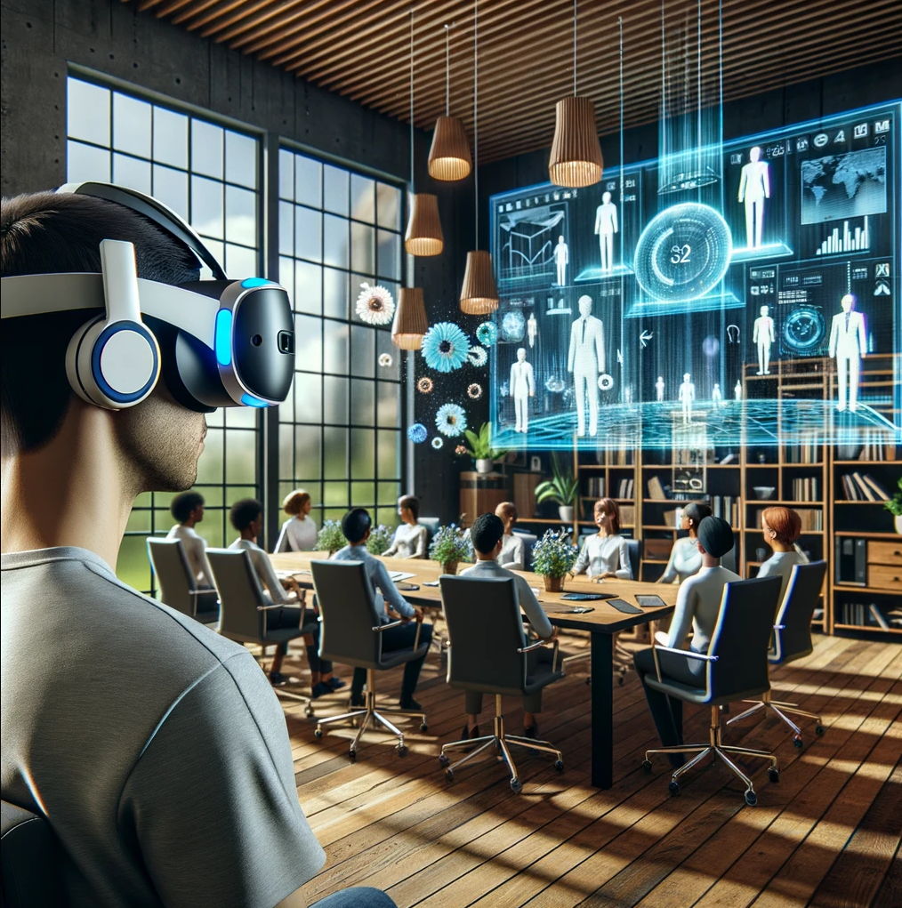

The experience of working from home, while advantageous in many respects, often comes with its own set of challenges. One of the subtlest, yet pervasive, is the monotony of being in the same environment day after day. That familiar desk corner, the same view out of the window, and the repetitive hum of daily life can sometimes make us feel confined. Additionally, while webcams and video conferencing tools provide a window to the outside world, they often feel like just that: a small window, rather than an expansive view. It's in this context that the concept of a virtual workspace gains appeal. Imagine the ability to customize your surroundings at will or even meet colleagues in settings that break the mold of your usual four walls. This isn't about escaping reality, but rather enriching our work environment, offering a fresh perspective and, potentially, reinvigorating our connection to the broader world.

Enter [Workrooms](https://forwork.meta.com/ca/horizon-workrooms/), a VR meeting and workspace platform by Meta. In this post, I'll explore my experience of using [Workrooms](https://forwork.meta.com/ca/horizon-workrooms/) to meet with colleagues and to work in a virtual home office, and I'll share some of my thoughts on the potential of VR in the workplace.

## Meta Meetings

While video conferencing tools like Zoom have undeniably facilitated the shift to remote work, they often leave something to be desired. Facing a mosaic of floating heads, or attempting to whiteboard with just a mouse and keyboard, hardly compares to the benefits of meeting in a tangible shared space. This is where the allure of virtual meetings comes into play: offering a shared virtual environment as an answer to our missing physical interactions.

### Collaboration: A New Dimension
When it comes to collaboration, Workrooms offers a significant leap from the functionalities we've grown used to. Traditional platforms like Zoom, while efficient, come with limitations. Features such as screen sharing or white-boarding are constrained by the medium. They often compete for the same screen real estate with video feeds, making interactions feel cluttered. Moreover, they lack the spatial context that's inherent to face-to-face meetings.

The beauty of VR meetings lies in the ability to contextualize interactions. Being present in a shared "physical" VR space, you can not only see what's being shared but also gauge where your colleagues' attention is. Are they focused on you, their screen, a whiteboard, or the shared presentation? This dimensionality replicates some aspects of in-person interactions, streamlining communication. Gone are the days when you'd have to juggle multiple windows on Zoom or feel detached speaking to an array of inscrutable faces. In VR, spotlighting a point of interest or corralling collective attention becomes as simple as pointing or physically moving towards it.

I was delightfully impressed with the collaborative features that Workrooms provides. By default, each participant is positioned around a virtual table, equipped with a personal virtual monitor that displays their computer screen, visible only to them. This setup eliminated the usual window-juggling act, allowing me to effortlessly switch my focus between my colleagues and my own screen.

The meeting room boasts a communal whiteboard that participants can approach and interact with, whether it's sketching diagrams or placing sticky notes. Additionally, each participant's desk has an option to transform its surface into a mini-whiteboard, mirroring the main one. Using the controller as a stylus provides a considerably more natural writing experience compared to the conventional mouse.

For those moments when you need a glimpse of the real world — say, to locate your mouse, keyboard, or perhaps that cup of coffee — there's a feature that creates a visual portal to your actual desk. Another brilliant feature is showcased if you physically leave your desk to walk to the shared whiteboard; Workrooms partially enables passthrough so you can safely navigate your real world space.

But what really sets Workrooms apart, especially when juxtaposed with platforms like Immersed VR, is the sheer intuitiveness and user-friendliness of its features.

### Socializing: Missing The Human Touch
However, when it comes to the nuances of human connection, traditional video calls may still hold an edge. Yes, VR offers some fantastic social elements. The ability to high-five virtually, complete with animations and sound effects in Workrooms, brings a delightful touch of whimsy. Engaging in one-on-one conversations, looking directly at one another, face-to-face, feels more intimate and personal than staring at a grid of faces on a screen.

But there are gaps. On the Quest 3, body tracking only captures head and hand movements. This limited tracking results in awkward avatars that serve as a constant reminder of the artificialness of the experience. Though Meta has hinted at the integration of shoulder and possibly leg tracking, that may be a while off, and it's yet to be determined how much of a difference it will make.

The most significant chasm, however, lies in the representation of facial expressions. In real world interactions, subtle nuances in our expressions convey volumes, often more than words can. Even with the face tracking on the Quest Pro, which two of my colleagues were wearing, the animations were too broad to capture these nuances, especially given Meta's current cartoonish avatars. The promise of [photorealistic codec avatars](https://www.youtube.com/watch?v=EohIA7QPmmE) might be the solution, but these appear to be very much in the research stages, and it remains to be seen whether they'll surpass the uncanny valley.

### Overall VR Meetings Impression
Overall I was quite impressed with what Meta has to offer, and I'm excited to experiment with more meetings virtually. But I don't think I'll be ditching my webcam any time soon.

## Workrooms as a Virtual Personal Workspace

After enjoying my virtual meeting in Workrooms, I was inspired to try it out for my own personal use, replacing my 34" monitor and sparsely decorated home office space with virtual ones. After hours of immersed in a virtual work world, submitting merge requests and responding to Slack messages, here's what I found.

### The Bright Side
#### A Virtual Multi-Monitor Setup:
My real-world office boasts a sizable 34" monitor, and yet the screen space always feels cluttered. Workrooms offered a refreshing change. With just its three virtual desktops, I could segregate tasks more efficiently. My left screen housed reference tools like browsers and Obsidian, while the central one was reserved for IDEs. The rightmost screen was a split between Slack and my [Reclaim.ai](https://reclaim.ai/) calendar. The arrangement felt more streamlined and organized and I found myself moving things around very little if at all.

#### A Zen-like Focus:
This was an unexpected boon. The moment I entered the virtual office space (the 'Lobby - Dark' environment being my personal favorite with its sporadic shooting stars), I felt engulfed in a flow state. Despite having a home office, real-world distractions fade in comparison to the immersive experience of a VR workspace. Perhaps the novelty of the experience played into this, and the effect would fade with time. Even so, occasionally strapping on the headset for a period of intense focus could be a wonderful tool in your productivity arsenal.

### The Not-so-Great
#### A Question of Comfort
It took some adjustments, but once I got the flimsy stock head strap right and reminded myself to relax my eyes periodically, the experience became acceptably comfortable, even after several hours. That said, wearing a 1lb computer on your face is no match for the freedom of wearing nothing at all. I am hopeful that the upcoming [BoboVR M3](https://www.bobovr.com/products/bobovr-m3-pro) head strap might elevate the comfort level. But whether an acceptable level of comfort can be achieved will come down to individuals and their discomfort tolerances.

> **Update:**
> I received the BoboVR M3 head strap and it's a significant improvement in comfort. I've had 1 to 2 hour sessions
> in the headset and felt perfectly at ease.

#### The Resolution Hurdle
The much-hyped graphics and improved resolution of the Quest 3 didn't quite live up to my expectations (which admittedly may have been set too high as I lapped up the promotion for the device). In Workrooms, the text clarity on my virtual monitors was serviceable, but noticeably pixelated and even fuzzy on smaller fonts. I found this particularly irksome while coding (I use Jetbrains Mono at size 13). Enlarging the text improved the situation but ate up precious screen space, negating some of the virtual multi-monitor advantage. To verify whether the lackluster picture quality was a Workrooms or Quest 3 issue, I opened up the Immersed VR app for comparison. The resolution was marginally better but still not ideal. While I could potentially adjust settings in Immersed for better clarity, its cumbersome UI pushed me back to Workrooms. Perhaps some software updates to Workrooms will improve this in the future.

#### The Battery Conundrum
The Quest 3's battery life, capping at 1.5 to 2 hours, is a well known shortcoming. It's nowhere close to covering a standard workday. You could potentially use the charging breaks as rest periods, but the 2.5-hour charging duration is too long for a break. There is an "Extended battery mode" setting, which seemed promising, but even with this turned on my device's battery was drained before lunchtime, even when plugged in. External battery solutions which worked for Quest 2, such as the hot-swappable batteries on the [BoboVR M2](https://www.bobovr.com/products/bobovr-m2-pro), are apparently unable to keep up with the power-hungry demands of Quest 3, making this a major stumbling block for extended use.

> **Update:**
> While many have reported that the BoboVR M3 battery is unable to keep the Quest 3 battery topped off, mine has worked 
> perfectly, keeping the device at 100% and giving me an extra hour+ of life. 

### Overall Virtual Office Impression
The idea of a virtual personal workspace is tantalizing. If Workrooms could tackle the text-clarity issues, I might genuinely consider making use of it daily. For now, it offers a promising glimpse into the future of virtual workspaces.

